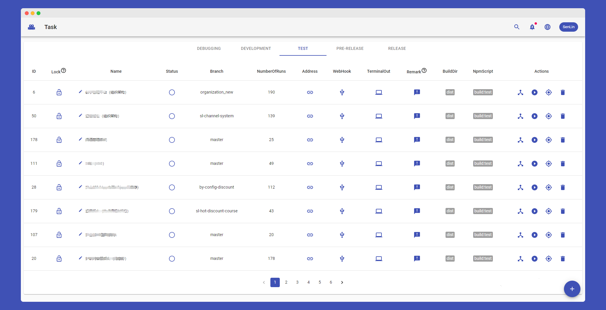
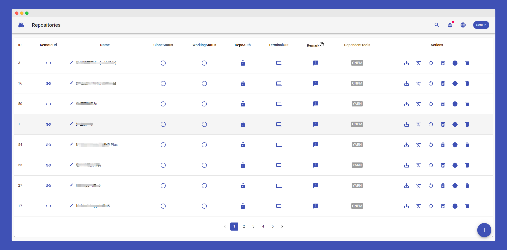

<div align=center>

</div>
<div align=center>


</div>



# MareWood
>MareWood 是一个轻量级的前端部署工具，使用了 GOLANG、GIN、GORM、JWT、WEBSOCKET、SQLITE、REACT、MATERIAL-UI 开发，
不同于 Jenkins 的大而全，它很简单且只针对前端，你可以很灵活的配置各种部署环境。
如果你愿意，线上发布也可以是点击一下按钮这么简单的事情,当然也可以配置 WEBHOOK，提交 GIT 代码既自动发布。


# MareWood 在做什么
MareWood 可以帮你克隆前端仓库并使用你选择的工具安装依赖，并能在同一个仓库下通过不同的任务不同的打包命令和不同的分支打包出多个环境下的前端资源并放在 resources\webs 下，通过任务 ID 一一对应，并提供快捷访问，超级简单好用灵活。


# 使用

用户使用： 1.填入仓库地址->2.可以新建多个任务关联此仓库->3.点击打包等待完成即可访问。
> 任务一旦生成，可以随时切换分支打包。


## Docker 安装
marewood容器目录/marewood/resources 包含了程序数据库、所有后续克隆的仓库和打包好的前端资源，建议将其映射到宿主机的某个目录下，以便于数据的持久化。
```
docker run -d --name marewood -p 8088:8088 -v ~/marewood:/marewood/resources ghcr.io/xusenlin/marewood:0.4
```
这样即可通过8088端口访问MareWood，通过 localhost:8088/webs/taskId 即可访打包好的仓库资源。建议使用nginx给~/marewood/webs提供静态文件服务器 ，以便于使用https访问前端内容。
```
docker run -d --name marewood -p 8088:8088 -v ~/marewood:/marewood/resources -e MW_URL=https://your-url.com ghcr.io/xusenlin/marewood:0.4 
```
这样marewood提供快捷访问https://your-url.com/taskId


## 手动安装
- 服务器请先安装 git、node、npm，建议同时安装 cnpm 和 yarn 以供选择。
- 通过MW_PORT和MW_URL环境变量来配置 MareWood 启动的端口号、前端资源域名。
- 进入 public 目录安装前端依赖并打包生成build文件夹。
- 编译 MareWood 并放入后台运行。

其他：MareWood 提供 http 访问，建议 nginx 提供 https 静态文件服务器（nginx指向resources\webs）这样可以灵活的选择 http 或者 https 去访问打包的前端项目。


那么，一个 React 或者 Vue 项目如何配置多个打包命令呢？请移步
http://xusenlin.com/article?key=iQBftC
如果不明白也可以参考实际的项目

- https://github.com/xusenlin/VueMultiplePages.git
- https://github.com/xusenlin/VueElementUiAdmin.git

# 角色

角色目前分为超级管理员、管理员、开发者、项目记者。权限如下：

- 项目记者 - 只能查看所有内容，并且可以访问打包好的前端项目
- 开发者 - 拥有创建仓库、分类、任务和拉代码、切换分支、运行打包、删除依赖、裁剪分支权限
- 管理员 - 可以删除仓库、分类、任务
- 超级管理员 -可以管理用户（提升和降级角色，删除用户）

注：等级高的角色拥有低级角色的全部权限。用户注册默认成为项目记者，如果注册的名字是 Admin 会自动成为超级管理员，注册名字不可重复。

# 更新日志
### 未发布（当前代码2022.11.07）
* 添加一键下载打包好的压缩文件（访问you-url/run_task_and_pack?id=3即可使用最新代码打包对应任务并生成压缩包下载）
* 添加任务默认分支修改为main

### v0.40
(此版本升级需要将jobs表修改为tasks，仓库表的字段job_status修改为task_status，分类表job_quantity修改为task_quantity)
* 重新优化了 Logo,看起来比之前聪明了 :) (2021-01-17)
* 添加在线人数显示 （2021-01-05）
* 添加国际化支持（2021-01-05）
* 添加任务可快速定位到对应仓库 （2020-12-31）
* webhook支持post或者get请求 （2020-12-30）
* 重构了前端任务的部分代码 （2020-12-30）
* 优化了搜索栏，添加分类可搜索 （2020-12-30）
* 添加了websocket通知记录 （2020-12-30）

### v0.30
* @wenbiyou 添加了任务和仓库的搜索功能 （2020-12-07）
* 添加了 websocket 重试机制
* @wojiaolingdu111 添加了仓库重建功能
* 添加了 websocket 广播，每个仓库和任务状态实时同步所有人。
* 优化了接口请求加载动画禁止页面操作。
* 添加了查看用户提交代码记录的功能。

### v0.20
* 添加丢弃本地仓库变动的功能 （2020-07-23）
* 修复运行老的任务分支不存在的 BUG (2020-06-25)
* 可以快捷修改更多字段和添加任务分页
* 缩短必要时的任务查询时间，完成打包及时知道
* 将任务密码重构为任务加锁解锁（多人协作时方便锁定任务，但是密码是透明的）
* 修复了裁剪分支和新建仓库不刷新相关BUG
* 设计了 MareWood 的矢量 logo
* 删除了读取的 dev 打包命令
* 设置 Token 失效时间为 10H
* 添加了裁剪分支的功能，可以手动保持和远程分支一致

### v0.12
* 添加用户和权限控制模块
* 可以快速修改仓库、分类、任务描述
* 优化和重构了大部分前后端代码
* 优化了前端界面UI
* 修复了一部分代码的隐藏 BUG

### v0.10
* 仪表盘的关键信息展示
* 仓库列表的相关功能（克隆、锁定、更新代码、删除依赖、依赖工具、删除仓库等功能）
* 任务分类（除了按照打包环境分类也可以按照 后台管理、H5活动、M站等自由发挥）
* 部署任务（同一个前端仓库可以新建多个部署任务，每个部署任务可以任意分支任意命令打包并提供访问）


# 番外

MareWood 翻译过来是 玛瑞·伍德 看上去像是一个人的名字，其实它是代表两个人，一个咒语。


# License

MIT © Richard McRichface
